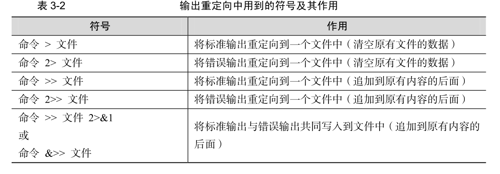
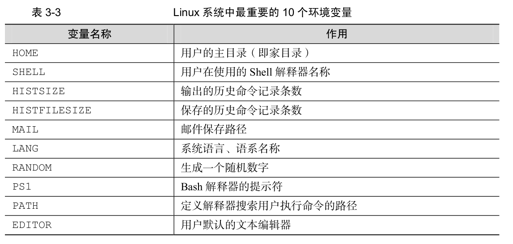
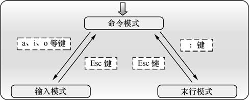
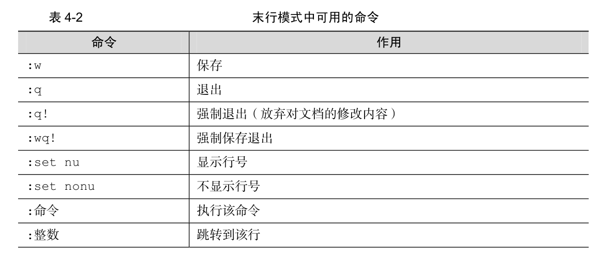
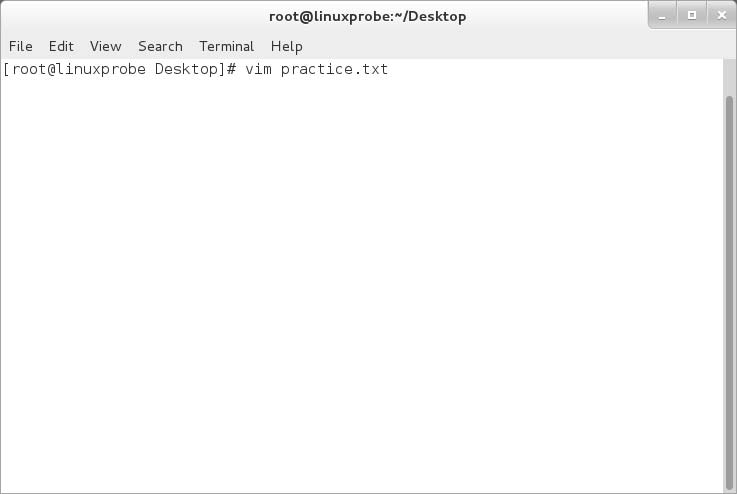
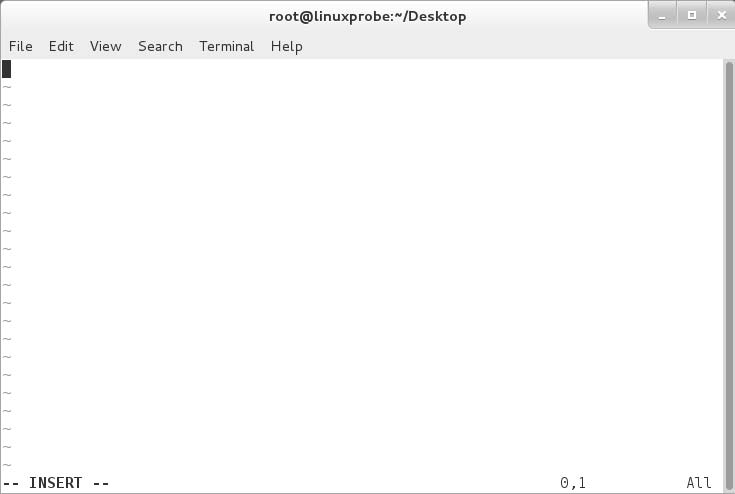
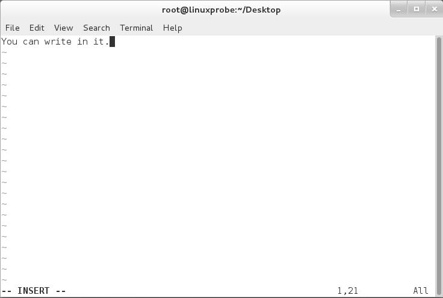
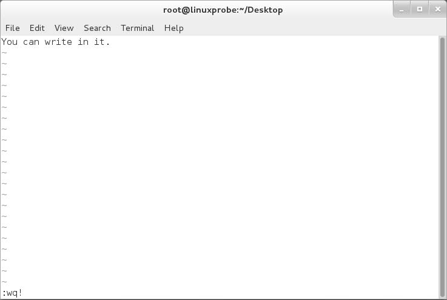

# 第二章 新手必须掌握的Linux命令

## 2.2 执行查看帮助命令

常见执行 Linux 命令的格式是这样的：

```
命令名称 [命令参数] [命令对象]
```

注意，命令名称、命令参数、命令对象之间请用空格键分隔。

命令对象一般是指要处理的文件、目录、用户等资源，而命令参数可以用长格式（完整的选项名称），也可以用短格式（单个字母的缩写），两者分别用--与-作为前缀（示例请见表2-1）。

表 2-1 命令参数的长格式与短格式示例

| 长格式 | man --help |
| ------ | ---------- |
| 短格式 | man -h     |

在 man 命令帮助信息的界面中，所包含的常用操作按键及其用途如表 2-2 所示。

表 2-2 man 命令中常用按键以及用途

| 按键      | 用途                               |
| --------- | ---------------------------------- |
| 空格键    | 向下翻一页                         |
| PaGe down | 向下翻一页                         |
| PaGe up   | 向上翻一页                         |
| home      | 直接前往首页                       |
| end       | 直接前往尾页                       |
| /         | 从上至下搜索某个关键词，如“/linux” |
| ?         | 从下至上搜索某个关键词，如“?linux” |
| n         | 定位到下一个搜索到的关键词         |
| N         | 定位到上一个搜索到的关键词         |
| q         | 退出帮助文档                       |

一般来讲，使用 man 命令查看到的帮助内容信息都会很长很多，如果读者不了解帮助文档信息的目录结构和操作方法，乍一看到这么多信息可能会感到相当困惑。man 命令的帮助信息的结构如表 2-3 所示。

表 2-3 man 命令帮助信息的结构以及意义

| 结构名称    | 代表意义                 |
| ----------- | ------------------------ |
| NAME        | 命令的名称               |
| SYNOPSIS    | 参数的大致使用方法       |
| DESCRIPTION | 介绍说明                 |
| EXAMPLES    | 演示（附带简单说明）     |
| OVERVIEW    | 概述                     |
| DEFAULTS    | 默认的功能               |
| OPTIONS     | 具体的可用选项（带介绍） |
| ENVIRONMENT | 环境变量                 |
| FILES       | 用到的文件               |
| SEE ALSO    | 相关的资料               |
| HISTORY     | 维护历史和联系方式       |

## 2.3 常用系统工作指令

### 2.3.1 echo

echo 命令用于在终端输出字符串或变量提取后的值，格式为`echo [字符串 | $变量]`。

```shell
echo Linuxprobe.Com	#将输出 Linuxprobe.com
```

下面，我们使用$变量的方式提取变量 SHELL 的值，并将其输出到屏幕上：

```shell
echo $SHELL #将输出当前shell的位置	例如：/bin/bash
```

### 2.3.2 date 命令

 date 命令用于显示及设置系统的时间或日期，格式为`date [选项] [+指定的格式]`。


按照默认格式查看当前系统时间的 date 命令如下所示：

```shell
date
```

按照“年-月-日 小时:分钟:秒”的格式查看当前系统时间的 date 命令如下所示：

```shell
date "+%Y-%m-%d %H:%M:%S"
```

将系统的当前时间设置为 2017 年 9 月 1 日 8 点 30 分的 date 命令如下所示：

```shell
date -s "20170901 8:30:00"
```

### 2.3.3 reboot命令

reboot 命令用于重启系统，其格式为 `reboot`。由于重启计算机这种操作会涉及硬件资源的管理权限，因此默认只能使用 root 管理员来重启，其命令如下：

```shell
reboot
```

### 2.3.4 poweroff命令

poweroff 命令用于关闭系统，其格式为 `poweroff`。

该命令与 reboot 命令相同，都会涉及硬件资源的管理权限，因此默认只有 root 管理员才可以关闭电脑，其命令如下：

```shell
poweroff
```

### 2.3.5 wget命令（重要）

wget 命令用于在终端中下载网络文件，格式为`wget [参数] 下载地址`。


尝试使用 wget 命令从本书的配套站点中下载本书的最新 pdf 格式电子文档，这个文件的完整路径为 http://www.linuxprobe.com/docs/LinuxProbe.pdf，执行该命令后的下载效果如下：

```shell
wget http://www.linuxprobe.com/docs/LinuxProbe.pdf
```

接下来，我们使用 wget 命令递归下载 www.linuxprobe.com 网站内的所有页面数据以及文件，下载完后会自动保存到当前路径下一个名为 www.linuxprobe.com 的目录中。执行该操作的命令为 `wget -r -p http://www.linuxprobe.com`，该命令的执行结果如下。

```shell
wget -r -p http://www.linuxprobe.com
```

### 2.3.6 ps命令

ps 命令用于查看系统中的进程状态，格式为`ps [参数]`。


我们可以使用三种参数的联合方式来查看当前进程状态：

```shell
ps aux
```

注意：如前面所提到的，在 Linux 系统中的命令参数有长短格式之分，长格式和长格式之间不能合并，长格式和短格式之间也不能合并，但短格式和短格式之间是可以合并的，合并后仅保留一个-（减号）即可。另外 ps 命令可允许参数不加减号（-），因此可直接写成 ps aux 的样子。

### 2.3.7 top命令

top 命令用于动态地监视进程活动与系统负载等信息，其格式为 top。top 命令相当强大，能够动态地查看系统运维状态，完全将它看作 Linux 中的“强化版的Windows 任务管理器”。


### 2.3.8 pidof命令

pidof 命令用于查询某个指定服务进程的 PID 值，格式为`pidof [参数] [服务名称]`。

每个进程的进程号码值（PID）是唯一的，因此可以通过 PID 来区分不同的进程。例如，可以使用如下命令来查询本机上 sshd 服务程序的 PID：

```shell
pidof sshd
```

### 2.3.9 kill命令

kill 命令用于终止某个指定 PID 的服务进程，格式为“kill [参数] [进程 PID]”。

```shell
kill pid
```

### 2.3.10 killall命令

killall 命令用于终止某个指定名称的服务所对应的全部进程，格式为：`killall [参数] [进程名称]`。

通常来讲，复杂软件的服务程序会有多个进程协同为用户提供服务，如果逐个去结束这些进程会比较麻烦，此时可以使用 killall 命令来批量结束某个服务程序带有的全部进程。下面以 httpd 服务程序为例，来结束其全部进程。由于 RHEL7 系统默认没有安装 httpd 服务程序，因此大家此时只需看操作过程和输出结果即可，等学习了相关内容之后再来实践。

```shell
[root@linuxprobe ~]# pidof httpd
13581 13580 13579 13578 13577 13576
[root@linuxprobe ~]# killall httpd
[root@linuxprobe ~]# pidof httpd
[root@linuxprobe ~]#
```


## 2.4 系统状态检测命令

### 2.4.1 ifconfig命令

ifconfig 命令用于获取网卡配置与网络状态等信息，格式为`ifconfig [网络设备] [参数]`。

使用 ifconfig 命令来查看本机当前的网卡配置与网络状态等信息时，其实主要查看的就是网卡名称、inet 参数后面的 IP 地址、ether 参数后面的网卡物理地址（又称为 MAC 地址），以及 RX、TX 的接收数据包与发送数据包的个数及累计流量（即下面加粗的信息内容）：

```shell
[root@linuxprobe ~]# ifconfig
eno16777728: flags=4163<UP,BROADCAST,RUNNING,MULTICAST> mtu 1500
inet 192.168.10.10 netmask 255.255.255.0 broadcast 192.168.10.255
inet6 fe80::20c:29ff:fec4:a409 prefixlen 64 scopeid 0x20<link>
ether 00:0c:29:c4:a4:09 txqueuelen 1000 (Ethernet)
RX packets 36 bytes 3176 (3.1 KiB)
RX errors 0 dropped 0 overruns 0 frame 0
TX packets 38 bytes 4757 (4.6 KiB)
TX errors 0 dropped 0 overruns 0 carrier 0 collisions 0
lo: flags=73<UP,LOOPBACK,RUNNING> mtu 65536
inet 127.0.0.1 netmask 255.0.0.0
inet6 ::1 prefixlen 128 scopeid 0x10<host>
loop txqueuelen 0 (Local Loopback)
RX packets 386 bytes 32780 (32.0 KiB)
RX errors 0 dropped 0 overruns 0 frame 0
TX packets 386 bytes 32780 (32.0 KiB)
TX errors 0 dropped 0 overruns 0 carrier 0 collisions 0
```

### 2.4.2 uname命令

uname 命令用于查看系统内核与系统版本等信息，格式为`uname [-a]`。

在使用 uname 命令时，一般会固定搭配上-a 参数来完整地查看当前系统的内核名称、主机名、内核发行版本、节点名、系统时间、硬件名称、硬件平台、处理器类型以及操作系统名称等信息。

### 2.4.3 uptime命令

uptime 用于查看系统的负载信息，格式为 uptime。

uptime 命令真的很棒，它可以显示当前系统时间、系统已运行时间、启用终端数量以及平均负载值等信息。平均负载值指的是系统在最近 1 分钟、5 分钟、15 分钟内的压力情况（下面加粗的信息部分）；负载值越低越好，尽量不要长期超过 1，在生产环境中不要超过 5。

```shell
[root@linuxprobe ~]# uptime
22:49:55 up 10 min, 2 users, load average: 0.01, 0.19, 0.18
```

### 2.4.4 free命令

free 用于显示当前系统中内存的使用量信息，格式为`free [-h]`。

为了保证 Linux 系统不会因资源耗尽而突然宕机，运维人员需要时刻关注内存的使用量。在使用 free 命令时，可以结合使用-h 参数以更人性化的方式输出当前内存的实时使用量信息。表 2-8 所示为在刘遄老师的电脑上执行 free -h 命令之后的输出信息。需要注意的是，输出信息中的中文注释是作者自行添加的内容，实际输出时没有相应的参数解释。


### 2.4.5 who命令

who 用于查看当前登入主机的用户终端信息，格式为`who [参数]`。

这三个简单的字母可以快速显示出所有正在登录本机的用户的名称以及他们正在开启的终端信息。表 2-9 所示为执行 who 命令后的结果。


### 2.4.6 last命令

last 命令用于查看所有系统的登录记录，格式为`last [参数]`。

使用 last 命令可以查看本机的登录记录。但是，由于这些信息都是以日志文件的形式保存在系统中，因此黑客可以很容易地对内容进行篡改。千万不要单纯以该命令的输出信息而判断系统有无被恶意入侵！

```
[root@linuxprobe ~]# last
root pts/0 :0 Mon Aug 24 17:52 still logged in
root :0 :0 Mon Aug 24 17:52 still logged in
(unknown :0 :0 Mon Aug 24 17:50 - 17:52 (00:02)
reboot system boot 3.10.0-123.el7.x Tue Aug 25 01:49 - 18:17 (-7:-32)
root pts/0 :0 Mon Aug 24 15:40 - 08:54 (7+17:14)
root pts/0 :0 Fri Jul 10 10:49 - 15:37 (45+04:47)
………………省略部分登录信息………………
```

### 2.4.7 history命令

history 命令用于显示历史执行过的命令，格式为`history [-c]`。

history 命令应该是作者最喜欢的命令。执行 history 命令能显示出当前用户在本地计算机中执行过的最近 1000 条命令记录。如果觉得 1000 不够用，还可以自定义/etc/profile 文件中的HISTSIZE 变量值。在使用 history 命令时，如果使用-c 参数则会清空所有的命令历史记录。还可以使用“!编码数字”的方式来重复执行某一次的命令。总之，history 命令有很多有趣的玩法等待您去开发。

```shell
root@linuxprobe ~]# history
1 tar xzvf VMwareTools-9.9.0-2304977.tar.gz
2 cd vmware-tools-distrib/
3 ls
4 ./vmware-install.pl -d
5 reboot
6 df -h
7 cd /run/media/
8 ls
9 cd root/
10 ls
11 cd VMware\ Tools/
12 ls
13 cp VMwareTools-9.9.0-2304977.tar.gz /home
14 cd /home
15 ls
16 tar xzvf VMwareTools-9.9.0-2304977.tar.gz
17 cd vmware-tools-distrib/
18 ls
19 ./vmware-install.pl -d
20 reboot
21 history
[root@linuxprobe ~]# !15
anaconda-ks.cfg Documents initial-setup-ks.cfg Pictures Templates
Desktop Downloads Music Public Videos
```

历史命令会被保存到用户家目录中的.bash_history 文件中。Linux 系统中以点（.）开头的文件均代表隐藏文件，这些文件大多数为系统服务文件，可以用 cat 命令查看其文件内容。

```shell
[root@linuxprobe ~]# cat ~/.bash_history
```

要清空当前用户在本机上执行的 Linux 命令历史记录信息，可执行如下命令：

```shell
[root@linuxprobe ~]# history -c
```

### 2.4.8 sosreport命令

sosreport 命令用于收集系统配置及架构信息并输出诊断文档，格式为 sosreport。

当 Linux 系统出现故障需要联系技术支持人员时，大多数时候都要先使用这个命令来简单收集系统的运行状态和服务配置信息，以便让技术支持人员能够远程解决一些小问题，亦或让他们能提前了解某些复杂问题。在下面的输出信息中，加粗的部分是收集好的资料压缩文件以及校验码，将其发送给技术支持人员即可：

```shell
[root@linuxprobe ~]# sosreport
sosreport (version 3.0)
This command will collect diagnostic and configuration information from
this Red Hat Enterprise Linux system and installed applications.
An archive containing the collected information will be generated in
/var/tmp and may be provided to a Red Hat support representative.
Any information provided to Red Hat will be treated in accordance with
the published support policies at:
https://access.redhat.com/support/
The generated archive may contain data considered sensitive and its
content should be reviewed by the originating organization before being
passed to any third party.
No changes will be made to system configuration.
Press ENTER to continue, or CTRL-C to quit. 此处敲击回车来确认收集信息
Please enter your first initial and last name [linuxprobe.com]: 此处敲击回车来确认主机编号
Please enter the case number that you are generating this report for: 此处敲击回
车来确认主机编号
Running plugins. Please wait ...
Running 70/70: yum...
Creating compressed archive...
Your sosreport has been generated and saved in:
/var/tmp/sosreport-linuxprobe.com-20170905230631.tar.xz
The checksum is: 79436cdf791327040efde48c452c6322
Please send this file to your support representative.
```

## 2.5 工作目录切换命令

### 2.5.1 pwd命令

pwd 命令用于显示用户当前所处的工作目录，格式为`pwd [选项]`。

### 2.5.2 cd命令

cd 命令用于切换工作路径，格式为`cd [目录名称]`。

这个命令应该是最常用的一个 Linux 命令了。可以通过 cd 命令迅速、灵活地切换到不同的工作目录。除了常见的切换目录方式，还可以使用`cd -`命令返回到上一次所处的目录，使用`cd..`命令进入上级目录，以及使用`cd ~`命令切换到当前用户的家目录，亦或使用`cd ~username`切换到其他用户的家目录。

### 2.5.3 ls命令

ls 命令用于显示目录中的文件信息，格式为`ls [选项] [文件] `。

所处的工作目录不同，当前工作目录下的文件肯定也不同。使用 ls 命令的“-a”参数看到全部文件（包括隐藏文件），使用“-l”参数可以查看文件的属性、大小等详细信息。将这两个参数整合之后，再执行 ls 命令即可查看当前目录中的所有文件并输出这些文件的属性信息：

```shell
[root@linuxprobe ~]# ls -al
total 60
dr-xr-x---. 14 root root 4096 May 4 07:56 .
drwxr-xr-x. 17 root root 4096 May 4 15:55 ..
-rw-------. 1 root root 1213 May 4 15:44 anaconda-ks.cfg
-rw-------. 1 root root 957 May 4 07:54 .bash_history
-rw-r--r--. 1 root root 18 Dec 28 2013 .bash_logout
-rw-r--r--. 1 root root 176 Dec 28 2013 .bash_profile
-rw-r--r--. 1 root root 176 Dec 28 2013 .bashrc
drwx------. 10 root root 4096 May 4 07:56 .cache
drwx------. 15 root root 4096 May 4 07:49 .config
-rw-r--r--. 1 root root 100 Dec 28 2013 .cshrc
drwx------. 3 root root 24 May 4 07:46 .dbus
drwxr-xr-x. 2 root root 6 May 4 07:49 Desktop
drwxr-xr-x. 2 root root 6 May 4 07:49 Documents
drwxr-xr-x. 2 root root 6 May 4 07:49 Downloads
-rw-------. 1 root root 16 May 4 07:49 .esd_auth
-rw-------. 1 root root 628 May 4 07:56 .ICEauthority
-rw-r--r--. 1 root root 1264 May 4 07:48 initial-setup-ks.cfg
drwx------. 3 root root 18 May 4 07:49 .local
drwxr-xr-x. 2 root root 6 May 4 07:49 Music
drwxr-xr-x. 2 root root 6 May 4 07:49 Pictures
drwxr-xr-x. 2 root root 6 May 4 07:49 Public
-rw-r--r--. 1 root root 129 Dec 28 2013 .tcshrc
drwxr-xr-x. 2 root root 6 May 4 07:49 Templates
drwxr-xr-x. 2 root root 6 May 4 07:49 Videos
-rw-------. 1 root root 1962 May 4 07:54 .viminfo
```

如果想要查看目录属性信息，则需要额外添加一个`-d` 参数。例如，可使用如下命令查看`/etc `目录的权限与属性信息：

```shell
[root@linuxprobe ~]# ls -ld /etc
drwxr-xr-x. 132 root root 8192 Jul 10 10:48 /etc
```

## 2.6 文本文件编辑命令

### 2.6.1 cat命令

cat 命令用于查看纯文本文件（内容较少的），格式为`cat [选项] [文件]`。

如果在查看文本内容时还想顺便显示行号的话，不妨在cat 命令后面追加一个-n 参数：

```shell
[root@linuxprobe ~]# cat -n initial-setup-ks.cfg
1 #version=RHEL7
2 # X Window System configuration information
3 xconfig --startxonboot
4
5 # License agreement
6 eula --agreed
7 # System authorization information
8 auth --enableshadow --passalgo=sha512
9 # Use CDROM installation media
10 cdrom
11 # Run the Setup Agent on first boot
12 firstboot --enable
13 # Keyboard layouts
14 keyboard --vckeymap=us --xlayouts='us'
15 # System language
16 lang en_US.UTF-8
………………省略部分输出信息………………
```

### 2.6.2 more命令

more 命令用于查看纯文本文件（内容较多的），格式为`more [选项]文件`。

如果需要阅读长篇小说或者非常长的配置文件，那么“小猫咪”可就真的不适合了。因为一旦使用 cat 命令阅读长篇的文本内容，信息就会在屏幕上快速翻滚，导致自己还没有来得及看到，内容就已经翻篇了。因此对于长篇的文本内容，推荐使用 more 命令来查看。more
命令会在最下面使用百分比的形式来提示您已经阅读了多少内容。您还可以使用空格键或回车键向下翻页：

```shell
[root@linuxprobe ~]# more initial-setup-ks.cfg
#version=RHEL7
# X Window System configuration information
xconfig --startxonboot
# License agreement
eula --agreed
# System authorization information
auth --enableshadow --passalgo=sha512
# Use CDROM installation media
cdrom
# Run the Setup Agent on first boot
firstboot --enable
# Keyboard layouts
keyboard --vckeymap=us --xlayouts='us'
# System language
lang en_US.UTF-8
ignoredisk --only-use=sda
# Network information
network --bootproto=dhcp --device=eno16777728 --onboot=off --ipv6=auto
network --bootproto=dhcp --hostname=linuxprobe.com
--More--(43%)
```

### 2.6.3 head命令

head 命令用于查看纯文本文档的前 N 行，格式为`head [选项] [文件]`。

如果只想查看文本中前 20 行的内容，该怎么办呢？head 命令可以派上用场了：

```shell
head -n 20 文件名
```

### 2.6.4 tail命令

tail 命令用于查看纯文本文档的后 N 行或持续刷新内容，格式为`tail [选项] [文件]`。

我们可能还会遇到另外一种情况，比如需要查看文本内容的最后 20 行，这时就需要用到tail 命令了。tail 命令的操作方法与 head 命令非常相似，只需要执行`tail -n 20 文件名`命令就可以达到这样的效果。tail 命令最强悍的功能是可以持续刷新一个文件的内容，当想要实时查看最新日志文件时，这特别有用，此时的命令格式为`tail -f 文件名`：

```shell
tail -f /var/log/messages
```

### 2.6.5 tr命令

tr 命令用于替换文本文件中的字符，格式为`tr [原始字符] [目标字符]`。

在很多时候，我们想要快速地替换文本中的一些词汇，又或者把整个文本内容都进行替换，如果进行手工替换，难免工作量太大，尤其是需要处理大批量的内容时，进行手工替换更是不现实。这时，就可以先使用 cat 命令读取待处理的文本，然后通过管道符（详见第 3
章）把这些文本内容传递给 tr 命令进行替换操作即可。例如，把某个文本内容中的"#"全部替换为"$"：

```shell
 cat 文件名 | tr "#" "$"
```

### 2.6.6 wc命令

wc 命令用于统计指定文本的行数、字数、字节数，格式为`wc [参数] 文本`。


在 Linux 系统中，passwd 是用于保存系统账户信息的文件，要统计当前系统中有多少个用户，可以使用下面的命令来进行查询，是不是很神奇：

```shell
[root@linuxprobe ~]# wc -l /etc/passwd
38 /etc/passwd
```

### 2.6.7 stat命令

stat 命令用于查看文件的具体存储信息和时间等信息，格式为`stat 文件名称`。

stat 命令可以用于查看文件的存储信息和时间等信息，命令 stat anaconda-ks.cfg 会显示出文件的三种时间状态：Access、Modify、Change。这三种时间的区别将在下面的 touch命令中详细详解：

```shell
[root@linuxprobe ~]# stat anaconda-ks.cfg
File: ‘anaconda-ks.cfg’
Size: 1213 Blocks: 8 IO Block: 4096 regular file
Device: fd00h/64768d Inode: 68912908 Links: 1
Access: (0600/-rw-------) Uid: ( 0/ root) Gid: ( 0/ root)
Context: system_u:object_r:admin_home_t:s0
Access: 2017-07-14 01:46:18.721255659 -0400
Modify: 2017-05-04 15:44:36.916027026 -0400
Change: 2017-05-04 15:44:36.916027026 -0400
Birth: -
```

### 2.6.8 cut命令

cut 命令用于按“列”提取文本字符，格式为`cut [参数] 文本`。

在Linux 系统中，如何准确地提取出最想要的数据，这也是我们应该重点学习的内容。一般而言，按基于“行”的方式来提取数据是比较简单的，只需要设置好要搜索的关键词即可。**但是如果按列搜索，不仅要使用-f 参数来设置需要看的列数，还需要使用-d 参数来设置间隔符号。**passwd 在保存用户数据信息时，用户信息的每一项值之间是采用冒号来间隔的，接下来我们使用下述命令尝试提取出passwd 文件中的用户名信息，即提取以冒号（：）为间隔符号的第一列内容：

```shell
[root@linuxprobe ~]# head -n 2 /etc/passwd
root:x:0:0:root:/root:/bin/bash
bin:x:1:1:bin:/bin:/sbin/nologin
[root@linuxprobe ~]# cut -d: -f1 /etc/passwd
root
bin
daemon
adm
lp
sync
shutdown
halt
mail
operator
games
ftp
nobody
dbus
polkitd
unbound
colord
usbmuxd
avahi
avahi-autoipd
libstoragemgmt
saslauth
qemu
rpc
rpcuser
nfsnobody
rtkit
radvd
ntp
chrony
abrt
pulse
gdm
gnome-initial-setup
postfix
sshd
tcpdump
linuxprobe
```

### 2.6.9 diff命令

diff 命令用于比较多个文本文件的差异，格式为`diff [参数] 文件`。

在使用 diff 命令时，不仅可以使用--brief 参数来确认两个文件是否不同，还可以使用-c参数来详细比较出多个文件的差异之处，这绝对是判断文件是否被篡改的有力神器。例如，先使用 cat 命令分别查看 diff_A.txt 和 diff_B.txt 文件的内容，然后进行比较：

```shell
[root@linuxprobe ~]# cat diff_A.txt
Welcome to linuxprobe.com
Red Hat certified
Free Linux Lessons
Professional guidance
Linux Course
[root@linuxprobe ~]# cat diff_B.txt
Welcome tooo linuxprobe.com
Red Hat certified
Free Linux LeSSonS
////////.....////////
Professional guidance
Linux Course
```

接下来使用 diff --brief 命令显示比较后的结果，判断文件是否相同：

```shell
[root@linuxprobe ~]# diff --brief diff_A.txt diff_B.txt
Files diff_A.txt and diff_B.txt differ
```

最后使用带有-c 参数的 diff 命令来描述文件内容具体的不同：

```shell
[root@linuxprobe ~]# diff -c diff_A.txt diff_B.txt
*** diff_A.txt 2017-08-30 18:07:45.230864626 +0800
--- diff_B.txt 2017-08-30 18:08:52.203860389 +0800
***************
*** 1,5 ****
! Welcome to linuxprobe.com
Red Hat certified
! Free Linux Lessons
Professional guidance
Linux Course
--- 1,7 ----
! Welcome tooo linuxprobe.com
!
Red Hat certified
! Free Linux LeSSonS
! ////////.....////////
Professional guidance
Linux Course
```

## 2.7 文件目录管理命令

### 2.7.1 touch命令

touch 命令用于创建空白文件或设置文件的时间，格式为`touch [选项] [文件]`。

在创建空白的文本文件方面，这个 touch 命令相当简捷，简捷到没有必要铺开去讲。比如，touch linuxprobe 命令可以创建出一个名为 linuxprobe 的空白文本文件。对 touch 命令来讲，有难度的操作主要是体现在设置文件内容的修改时间（mtime）、文件权限或属性
的更改时间（ctime）与文件的读取时间（atime）上面。touch 命令的参数及其作用如表 2-11所示。


接下来，我们先使用 ls 命令查看一个文件的修改时间，然后修改这个文件，最后再通过 touch命令把修改后的文件时间设置成修改之间的时间（很多黑客就是这样做的呢）：

```shell
[root@linuxprobe ~]# ls -l anaconda-ks.cfg
-rw-------. 1 root root 1213 May 4 15:44 anaconda-ks.cfg
[root@linuxprobe ~]# echo "Visit the LinuxProbe.com to learn linux skills" >> anaconda-ks.cfg
[root@linuxprobe ~]# ls -l anaconda-ks.cfg
-rw-------. 1 root root 1260 Aug 2 01:26 anaconda-ks.cfg
[root@linuxprobe ~]# touch -d "2017-05-04 15:44" anaconda-ks.cfg
[root@linuxprobe ~]# ls -l anaconda-ks.cfg
-rw-------. 1 root root 1260 May 4 15:44 anaconda-ks.cfg
```

### 2.7.2 mkdir命令

mkdir 命令用于创建空白的目录，格式为`mkdir [选项] 目录`。

在 Linux 系统中，文件夹是最常见的文件类型之一。除了能创建单个空白目录外，mkdir命令还可以结合-p 参数来递归创建出具有嵌套叠层关系的文件目录。

```shell
[root@linuxprobe ~]# mkdir linuxprobe
[root@linuxprobe ~]# cd linuxprobe
[root@linuxprobe linuxprobe]# mkdir -p a/b/c/d/e
[root@linuxprobe linuxprobe]# cd a
[root@linuxprobe a]# cd b
[root@linuxprobe b]#
```

### 2.7.3 cp命令

cp 命令用于复制文件或目录，格式为`cp [选项] 源文件 目标文件`。

大家对文件复制操作应该不陌生，在 Linux 系统中，复制操作具体分为 3 种情况：

* 如果目标文件是目录，则会把源文件复制到该目录中
* 如果目标文件也是普通文件，则会询问是否要覆盖它
* 如果目标文件不存在，则执行正常的复制操作。

cp 命令的参数及其作用如表 2-12 所示。


### 2.7.4 mv命令

mv 命令用于剪切文件或将文件重命名，格式为`mv [选项] 源文件 [目标路径|目标文件名]`。

剪切操作不同于复制操作，因为它会默认把源文件删除掉，只保留剪切后的文件。如果在同一个目录中对一个文件进行剪切操作，其实也就是对其进行重命名：

```shell
[root@linuxprobe ~]# mv x.log linux.log
[root@linuxprobe ~]# ls
install.log linux.log
```

### 2.7.5 rm 命令

rm 命令用于删除文件或目录，格式为`rm [选项] 文件`。

在 Linux 系统中删除文件时，系统会默认向您询问是否要执行删除操作，如果不想总是看到这种反复的确认信息，可在 rm 命令后跟上-f 参数来强制删除。另外，想要删除一个目录，需要在 rm 命令后面一个-r 参数才可以，否则删除不掉。


### 2.7.6 dd命令

dd 命令用于按照指定大小和个数的数据块来复制文件或转换文件，格式为`dd [参数]`。

dd 命令是一个比较重要而且比较有特色的一个命令，它能够让用户按照指定大小和个数的数据块来复制文件的内容。当然如果愿意的话，还可以在复制过程中转换其中的数据。Linux系统中有一个名为/dev/zero 的设备文件，每次在课堂上解释它时都充满哲学理论的色彩。因为这个文件不会占用系统存储空间，但却可以提供无穷无尽的数据，因此可以使用它作为 dd命令的输入文件，来生成一个指定大小的文件。dd 命令的参数及其作用如表 2-13 所示。


例如我们可以用 dd 命令从/dev/zero 设备文件中取出一个大小为 560MB 的数据块，然后保存成名为 560_file 的文件。在理解了这个命令后，以后就能随意创建任意大小的文件了：

```shell
[root@linuxprobe ~]# dd if=/dev/zero of=560_file count=1 bs=560M
1+0 records in
1+0 records out
587202560 bytes (587 MB) copied, 27.1755 s, 21.6 MB/s
```


### 2.7.7 file命令

file 命令用于查看文件的类型，格式为`file 文件名`。

在 Linux 系统中，由于文本、目录、设备等所有这些一切都统称为文件，而我们又不能单凭后缀就知道具体的文件类型，这时就需要使用 file 命令来查看文件类型了。

```shell
[root@linuxprobe ~]# file anaconda-ks.cfg
anaconda-ks.cfg: ASCII text
[root@linuxprobe ~]# file /dev/sda
/dev/sda: block special
```

## 2.8 打包压缩与搜索命令

### 2.8.1 tar命令

tar 命令用于对文件进行打包压缩或解压，格式为`tar [选项] [文件]`。

在Linux 系统中，常见的文件格式比较多，其中主要使用的是.tar 或.tar.gz 或.tar.bz2 格式，我们不用担心格式太多而记不住，其实这些格式大部分都是由 tar 命令来生成的。刘遄老师将讲解最重要的几个参数，以方便大家理解。tar 命令的参数及其作用如表 2-14 所示。


首先，-c 参数用于创建压缩文件，-x 参数用于解压文件，因此这两个参数不能同时使用。其次，-z 参数指定使用 Gzip 格式来压缩或解压文件，-j 参数指定使用 bzip2 格式来压缩或解压文件。用户使用时则是根据文件的后缀来决定应使用何种格式参数进行解压。在执行某些压缩或解压操作时，可能需要花费数个小时，如果屏幕一直没有输出，您一方面不好判断打包的进度情况，另一方面也会怀疑电脑死机了，因此非常推荐使用-v 参数向用户不断显示压缩或解压的过程。-C 参数用于指定要解压到哪个指定的目录。-f 参数特别重要，它必须放到参数的最后一位，代表要压缩或解压的软件包名称。刘遄老师一般使用`tar -czvf 压缩包名称.tar.gz 要打包的目录`命令把指定的文件进行打包压缩；相应的解压命令为`tar -xzvf 压缩包名称.tar.gz`。下面我们来逐个演示下打包压缩与解压的操作。先使用 tar 命令把/etc 目录通过 gzip 格式进行打包压缩，并把文件命名为 etc.tar.gz：

```shell
[root@linuxprobe ~]# tar -czvf etc.tar.gz /etc
tar: Removing leading '/' from member names
/etc/
/etc/fstab
/etc/crypttab
/etc/mtab
/etc/fonts/
/etc/fonts/conf.d/
/etc/fonts/conf.d/65-0-madan.conf
/etc/fonts/conf.d/59-liberation-sans.conf
/etc/fonts/conf.d/90-ttf-arphic-uming-embolden.conf
/etc/fonts/conf.d/59-liberation-mono.conf
/etc/fonts/conf.d/66-sil-nuosu.conf
………………省略部分压缩过程信息………………
```

接下来将打包后的压缩包文件指定解压到/root/etc 目录中（先使用 mkdir 命令来创建/root/etc 目录）：

```shell
[root@linuxprobe ~]# mkdir /root/etc
[root@linuxprobe ~]# tar xzvf etc.tar.gz -C /root/etc
etc/
etc/fstab
etc/crypttab
etc/mtab
etc/fonts/
etc/fonts/conf.d/
etc/fonts/conf.d/65-0-madan.conf
etc/fonts/conf.d/59-liberation-sans.conf
etc/fonts/conf.d/90-ttf-arphic-uming-embolden.conf
etc/fonts/conf.d/59-liberation-mono.conf
etc/fonts/conf.d/66-sil-nuosu.conf
etc/fonts/conf.d/65-1-vlgothic-gothic.conf
etc/fonts/conf.d/65-0-lohit-bengali.conf
etc/fonts/conf.d/20-unhint-small-dejavu-sans.conf
………………省略部分解压过程信息………………
```

### 2.8.2 grep命令

grep 命令用于在文本中执行关键词搜索，并显示匹配的结果，格式为`grep [选项] [文件]`。

grep 命令的参数及其作用如表 2-15 所示。


grep 命令是用途最广泛的文本搜索匹配工具，虽然有很多参数，但是大多数基本上都用不到。

我们在这里只讲两个最最常用的参数：-n 参数用来显示搜索到信息的行号；-v 参数用于反选信息（即没有包含关键词的所有信息行）。这两个参数几乎能完成您日后 80%的工作需要，至于其他上百个参数，即使以后在工作期间遇到了，再使用 man grep 命令查询也来得及。

在 Linux 系统中，/etc/passwd 文件是保存着所有的用户信息，而一旦用户的登录终端被设置成/sbin/nologin，则不再允许登录系统，因此可以使用 grep 命令来查找出当前系统中不允许登录系统的所有用户信息：

```shell
[root@linuxprobe ~]# grep /sbin/nologin /etc/passwd
bin:x:1:1:bin:/bin:/sbin/nologin
daemon:x:2:2:daemon:/sbin:/sbin/nologin
adm:x:3:4:adm:/var/adm:/sbin/nologin
lp:x:4:7:lp:/var/spool/lpd:/sbin/nologin
mail:x:8:12:mail:/var/spool/mail:/sbin/nologin
operator:x:11:0:operator:/root:/sbin/nologin
………………省略部分输出过程信息………………
```

### 2.8.3 find命令

find 命令用于按照指定条件来查找文件，格式为`find [查找路径] 寻找条件 操作`。

本书中曾经多次提到“Linux 系统中的一切都是文件”，接下来就要见证这句话的分量了。在 Linux 系统中，搜索工作一般都是通过 find 命令来完成的，它可以使用不同的文件特性作为寻找条件（如文件名、大小、修改时间、权限等信息），一旦匹配成功则默认将信息显示到屏幕上。find 命令的参数以及作用如表 2-16 所示。


这里需要重点讲解一下-exec 参数重要的作用。这个参数用于把 find 命令搜索到的结果交由紧随其后的命令作进一步处理，它十分类似于第 3 章将要讲解的管道符技术，并且由于 find命令对参数的特殊要求，因此虽然 exec 是长格式形式，但依然只需要一个减号（-）。

根据文件系统层次标准（Filesystem Hierarchy Standard）协议，Linux 系统中的配置文件会保存到/etc 目录中（详见第 6 章）。如果要想获取到该目录中所有以 host 开头的文件列表，可以执行如下命令：

```shell
[root@linuxprobe ~]# find /etc -name "host*" -print
/etc/avahi/hosts
/etc/host.conf
/etc/hosts
/etc/hosts.allow
/etc/hosts.deny
/etc/selinux/targeted/modules/active/modules/hostname.pp
/etc/hostname
```

如果要在整个系统中搜索权限中包括 SUID 权限的所有文件（详见第 5 章），只需使用-4000 即可：

```shell
[root@linuxprobe ~]# find / -perm -4000 -print
/usr/bin/fusermount
/usr/bin/su
/usr/bin/umount
/usr/bin/passwd
/usr/sbin/userhelper
/usr/sbin/usernetctl
………………省略部分输出信息………………
```


# 第三章 管道符、重定向与环境变量

## 3.1 输入输出重定向

简而言之，输入重定向是指把文件导入到命令中，而输出重定向则是指把原本要输出到屏幕的数据信息写入到指定文件中。

在日常的学习和工作中，相较于输入重定向，我们使用输出重定向的频率更高，所以又将输出重定向分为了标准输出重定向和错误输出重定向两种不同的技术，以及清空写入与追加写入两种模式。

* 标准输入重定向（STDIN，文件描述符为 0）：默认从键盘输入，也可从其他文件或命令中输入。
* 标准输出重定向（STDOUT，文件描述符为 1）：默认输出到屏幕。
* 错误输出重定向（STDERR，文件描述符为 2）：默认输出到屏幕。

比如我们分别查看两个文件的属性信息，其中第二个文件是不存在的，虽然针对这两个文件的操作都分别会在屏幕上输出一些数据信息，但这两个操作的差异其实很大：

```shell
[root@linuxprobe ~]# touch linuxprobe
[root@linuxprobe ~]# ls -l linuxprobe
-rw-r--r--. 1 root root 0 Aug 5 05:35 linuxprobe
[root@linuxprobe ~]# ls -l xxxxxx
ls: cannot access xxxxxx: No such file or directory
```

在上述命令中，名为 linuxprobe 的文件是存在的，输出信息是该文件的一些相关权限、所有者、所属组、文件大小及修改时间等信息，这也是该命令的标准输出信息。而名为 xxxxxx的第二个文件是不存在的，因此在执行完 ls 命令之后显示的报错提示信息也是该命令的错误输出信息。那么，要想把原本输出到屏幕上的数据转而写入到文件当中，就要区别对待这两种输出信息。

对于输入重定向来讲，用到的符号及其作用如表 3-1 所示。


对于输出重定向来讲，用到的符号及其作用如表 3-2 所示。



对于重定向中的标准输出模式，可以省略文件描述符 1 不写，而错误输出模式的文件描述符 2是必须要写的。我们先来小试牛刀。通过标准输出重定向将man bash命令原本要输出到屏幕的信息写入到文件readme.txt中，然后显示readme.txt文件中的内容。具体命令如下：

```shell
[root@linuxprobe ~]# man bash > readme.txt
[root@linuxprobe ~]# cat readme.txt
BASH(1) General Commands Manual BASH(1)
NAME
bash - GNU Bourne-Again SHell
SYNOPSIS
bash [options] [file]
COPYRIGHT
Bash is Copyright (C) 1989-2011 by the Free Software Foundation, Inc.
DESCRIPTION
Bash is an sh-compatible command language interpreter that executes
commands read from the standard input or from a file. Bash also incor‐
porates useful features from the Korn and C shells (ksh and csh).
Bash is intended to be a conformant implementation of the Shell and
Utilities portion of the IEEE POSIX specification (IEEE Standard
1003.1). Bash can be configured to be POSIX-conformant by default.
………………省略部分输出信息………………
```

输入重定向相对来说有些冷门，在工作中遇到的概率会小一点。输入重定向的作用是把文件直接导入到命令中。接下来使用输入重定向把 readme.txt 文件导入给 wc -l 命令，统计一下文件中的内容行数。

```shell
wc -l < readme.txt
```

注意：上述命令实际上等同于接下来要学习的 cat readme.txt | wc -l 的管道符命令组合。

## 3.2 管道命令符

同时按下键盘上的 `Shift+\` 键即可输入管道符，其执行格式为`命令 A | 命令 B`。**命令符的作用也可以用一句话来概括“把前一个命令原本要输出到屏幕的数据当作是后一个命令的标准输入”。**

这个管道符就像一个法宝，我们可以将它套用到其他不同的命令上，比如用翻页的形式查看/etc 目录中的文件列表及属性信息（这些内容默认会一股脑儿地显示到屏幕上，根本看不清楚）：

```shell
[root@linuxprobe ~]# ls -l /etc/ | more
total 1400
drwxr-xr-x. 3 root root 97 Jul 10 17:26 abrt
-rw-r--r--. 1 root root 16 Jul 10 17:36 adjtime
-rw-r--r--. 1 root root 1518 Jun 7 2013 aliases
-rw-r--r--. 1 root root 12288 Jul 10 09:38 aliases.db
drwxr-xr-x. 2 root root 49 Jul 10 17:26 alsa
drwxr-xr-x. 2 root root 4096 Jul 10 17:31 alternatives
-rw-------. 1 root root 541 Jan 28 2017 anacrontab
-rw-r--r--. 1 root root 55 Jan 29 2017 asound.conf
-rw-r--r--. 1 root root 1 Jan 29 2017 at.deny
drwxr-xr-x. 2 root root 31 Jul 10 17:27 at-spi2
drwxr-x---. 3 root root 41 Jul 10 17:26 audisp
drwxr-x---. 3 root root 79 Jul 10 17:37 audit
drwxr-xr-x. 4 root root 94 Jul 10 17:26 avahi
--More--
```

在修改用户密码时，通常都需要输入两次密码以进行确认，这在编写自动化脚本时将成为一个非常致命的缺陷。通过把管道符和 passwd 命令的`--stdin` 参数相结合，我们可以用一条命令来完成密码重置操作：

```shell
[root@linuxprobe ~]# echo "linuxprobe" | passwd --stdin root
Changing password for user root.
passwd: all authentication tokens updated successfully.
```

当然，大家千万不要误以为管道命令符只能在一个命令组合中使用一次，我们完全可以这样使用：`命令 A | 命令 B | 命令 C`。

## 3.3 命令行的通配符

如果就记得一个文件的开头几个字母，想遍历查找出所有以这个关键词开头的文件，该怎么操作呢？又比如，假设想要批量查看所有硬盘文件的相关权限属性，一种方式是这样的：

```shell
[root@linuxprobe ~]# ls -l /dev/sda
brw-rw----. 1 root disk 8, 0 May 4 15:55 /dev/sda
[root@linuxprobe ~]# ls -l /dev/sda1
brw-rw----. 1 root disk 8, 1 May 4 15:55 /dev/sda1
[root@linuxprobe ~]# ls -l /dev/sda2
brw-rw----. 1 root disk 8, 2 May 4 15:55 /dev/sda2
[root@linuxprobe ~]# ls -l /dev/sda3
ls: cannot access /dev/sda3: No such file or directory
```

幸亏我的硬盘文件和分区只有 3 个，要是有几百个，估计需要花费一天的时间来忙这个事情了。由此可见，这种方式的效率确实很低。虽然我们在第 6 章才会讲解 Linux 系统的存储结构和 FHS，但现在我们应该能看出一些简单规律了。比如，这些硬盘设备文件都是以 sda开头并且存放到了/dev 目录中，这样一来，即使我们不知道硬盘的分区编号和具体分区的个数，也可以使用通配符来搞定**。顾名思义，通配符就是通用的匹配信息的符号，比如星号（*）代表匹配零个或多个字符，问号（?）代表匹配单个字符，中括号内加上数字[0-9]代表匹配 0～9之间的单个数字的字符，而中括号内加上字母[abc]则是代表匹配 a、b、c 三个字符中的任意一个字符。**俗话讲“百闻不如一见，看书不如实验”，下面我们就来匹配所有在/dev 目录中且以 sda 开头的文件：

```shell
[root@linuxprobe ~]# ls -l /dev/sda*
brw-rw----. 1 root disk 8, 0 May 4 15:55 /dev/sda
brw-rw----. 1 root disk 8, 1 May 4 15:55 /dev/sda1
brw-rw----. 1 root disk 8, 2 May 4 15:55 /dev/sda2
```

如果只想查看文件名为 sda 开头，但是后面还紧跟其他某一个字符的文件的相关信息，该怎么操作呢？这时就需要用到问号来进行通配了。

```shell
[root@linuxprobe ~]# ls -l /dev/sda?
brw-rw----. 1 root disk 8, 1 May 4 15:55 /dev/sda1
brw-rw----. 1 root disk 8, 2 May 4 15:55 /dev/sda2
```

**除了使用[0-9]来匹配 0~9 之间的单个数字，也可以用[135]这样的方式仅匹配这三个指定数字中的一个**，若没有匹配到，则不会显示出来：

```shell
[root@linuxprobe ~]# ls -l /dev/sda[0-9]
brw-rw----. 1 root disk 8, 1 May 4 15:55 /dev/sda1
brw-rw----. 1 root disk 8, 2 May 4 15:55 /dev/sda2
[root@linuxprobe ~]# ls -l /dev/sda[135]
brw-rw----. 1 root disk 8, 1 May 4 15:55 /dev/sda1
```

## 3.4 常用的转义字符

为了能够更好地理解用户的表达，Shell 解释器还提供了特别丰富的转义字符来处理输入的特殊数据。


我们先定义一个名为 PRICE 的变量并赋值为 5，然后输出以双引号括起来的字符串与变量信息：

```shell
[root@linuxprobe ~]# PRICE=5
[root@linuxprobe ~]# echo "Price is $PRICE"
Price is 5
```

接下来，我们希望能够输出“Price is \$5”，即价格是 5 美元的字符串内容，但碰巧美元符号与变量提取符号合并后的\$\$作用是显示当前程序的进程 ID 号码，于是命令执行后输出的内容并不是我们所预期的：

```shell
[root@linuxprobe ~]# echo "Price is $$PRICE"
Price is 3767PRICE
```

要想让第一个“\$”乖乖地作为美元符号，那么就需要使用反斜杠（\）来进行转义，将这个命令提取符转义成单纯的文本，去除其特殊功能。

```shell
[root@linuxprobe ~]# echo "Price is \$$PRICE"
Price is $5
```

而如果只需要某个命令的输出值时，可以像  **\`命令\`**  这样，将命令用反引号括起来，达到预期的效果。例如，将反引号与 uname -a 命令结合，然后使用 echo 命令来查看本机的 Linux版本和内核信息：

```shell
[root@linuxprobe ~]# echo `uname -a`
Linux linuxprobe.com 3.10.0-123.el7.x86_64 #1 SMP Mon May 5 11:16:57 EDT 2017
x86_64 x86_64 x86_64 GNU/Linux
```

## 3.5 重要的环境变量

变量是计算机系统用于保存可变值的数据类型。**在 Linux 系统中，变量名称一般都是大写的，这是一种约定俗成的规范。**我们可以直接通过变量名称来提取到对应的变量值。Linux系统中的环境变量是用来定义系统运行环境的一些参数，比如每个用户不同的家目录、邮件存放位置等。

**前文中曾经讲到，在 Linux 系统中一切都是文件，Linux 命令也不例外。**那么，在用户执行了一条命令之后，Linux 系统中到底发生了什么事情呢？简单来说，命令在 Linux 中的执行分为 4 个步骤。

1. 判断用户是否以绝对路径或相对路径的方式输入命令（如`/bin/ls`），如果是的话则直接执行。

2. Linux 系统检查用户输入的命令是否为“别名命令”，即用一个自定义的命令名称来替换原本的命令名称。可以用 alias 命令来创建一个属于自己的命令别名，格式为`alias 别名=命令`。若要取消一个命令别名，则是用 `unalias` 命令，格式为`unalias 别名`。
   我们之前在使用 rm 命令删除文件时，Linux 系统都会要求我们再确认是否执行删除操作，其实这就是 Linux 系统为了防止用户误删除文件而特意设置的 rm 别名命令，接下来我们把它取消掉：

   ```shell
   [root@linuxprobe ~]# ls
   anaconda-ks.cfg Documents initial-setup-ks.cfg Pictures Templates
   Desktop Downloads Music Public Videos
   [root@linuxprobe ~]# rm anaconda-ks.cfg
   rm: remove regular file ‘anaconda-ks.cfg’? y
   [root@linuxprobe~]# alias rm
   alias rm='rm -i'
   [root@linuxprobe ~]# unalias rm
   [root@linuxprobe ~]# rm initial-setup-ks.cfg
   [root@linuxprobe ~]#
   ```

3. Bash 解释器判断用户输入的是内部命令还是外部命令。内部命令是解释器内部的指令，会被直接执行；而用户在绝大部分时间输入的是外部命令，这些命令交由步骤 4 继续处理。可以使用`type 命令名称`来判断用户输入的命令是内部命令还是外部命令。

4. 系统在多个路径中查找用户输入的命令文件，而定义这些路径的变量叫作PATH，可以简单地把它理解成是“解释器的小助手”，作用是告诉 Bash 解释器待执行的命令可能存放的位置，然后 Bash 解释器就会乖乖地在这些位置中逐个查找。PATH 是由多个路径值组成的变量，每个路径值之间用冒号间隔，对这些路径的增加和删除操作将影响到 Bash 解释器对Linux 命令的查找。

   ```shell
   [root@linuxprobe ~]# echo $PATH
   /usr/local/bin:/usr/local/sbin:/usr/bin:/usr/sbin:/bin:/sbin
   [root@linuxprobe ~]# PATH=$PATH:/root/bin
   /usr/local/bin:/usr/local/sbin:/usr/bin:/usr/sbin:/bin:/sbin:/root/bin
   ```

这里有比较经典的问题：“为什么不能将当前目录（.）添加到 PATH 中呢? ” 原因是，尽管可以将当前目录（.）添加到 PATH 变量中，从而在某些情况下可以让用户免去输入命令所在路径的麻烦。但是，如果黑客在比较常用的公共目录/tmp 中存放了一个与 ls 或 cd 命令同名的木马文件，而用户又恰巧在公共目录中执行了这些命令，那么就极有可能中招了。

所以，作为一名态度谨慎、有经验的运维人员，在接手了一台 Linux 系统后一定会在执行命令前先检查 PATH 变量中是否有可疑的目录，另外读者从前面的 PATH 变量示例中是否也感觉到环境变量特别有用呢。我们可以使用 env 命令来查看到 Linux 系统中所有的环境变
量，有10个特别重要的环境变量，如表 3-3 所示。



Linux 作为一个多用户多任务的操作系统，能够为每个用户提供独立的、合适的工作运行环境，因此，一个相同的变量会因为用户身份的不同而具有不同的值。例如，我们使用下述命令来查看 HOME 变量在不同用户身份下都有哪些值（su 是用于切换用户身份的命令，将在第 5 章跟大家见面）：

```shell
[root@linuxprobe ~]# echo $HOME
/root
[root@linuxprobe ~]# su - linuxprobe
Last login: Fri Feb 27 19:49:57 CST 2017 on pts/0
[linuxprobe@linuxprobe ~]$ echo $HOME
/home/linuxprobe
```

其实变量是由固定的变量名与用户或系统设置的变量值两部分组成的，我们完全可以自行创建变量，来满足工作需求。例如设置一个名称为 WORKDIR 的变量，方便用户更轻松地进入一个层次较深的目录：

 ```shell
[root@linuxprobe ~]# mkdir /home/workdir
[root@linuxprobe ~]# WORKDIR=/home/workdir
[root@linuxprobe ~]# cd $WORKDIR
[root@linuxprobe workdir]# pwd
/home/workdir
 ```

但是，这样的变量不具有全局性，作用范围也有限，默认情况下不能被其他用户使用。如果工作需要，可以使用 **export** 命令将其提升为全局变量，这样其他用户也就可以使用它了：

```shell
[root@linuxprobe workdir]# su linuxprobe
Last login: Fri Mar 20 20:52:10 CST 2017 on pts/0
[linuxprobe@linuxprobe ~]$ cd $WORKDIR
[linuxprobe@linuxprobe ~]$ echo $WORKDIR
[linuxprobe@linuxprobe ~]$ exit
[root@linuxprobe ~]# export WORKDIR
[root@linuxprobe workdir]# su linuxprobe
Last login: Fri Mar 20 21:52:10 CST 2017 on pts/0
[linuxprobe@linuxprobe ~]$ cd $WORKDIR
[linuxprobe@linuxprobe workdir]$pwd
/home/workdir
```

# 第四章 Vim编辑器与Shell命令脚本

## 4.1 Vim文本编辑器

Vim 之所以能得到广大厂商与用户的认可，原因在于Vim 编辑器中设置了三种模式 — 命令模式、末行模式和编辑模式，每种模式分别又支持多种不同的命令快捷键，这大大提高了工作效率，而且用户在习惯之后也会觉得相当顺手。要想高效率地操作文本，就必须先搞清这三种模式的操作区别以及模式之间的切换方法（见图 4-1）。




图4-1 Vim 编辑器模式的切换方法

在每次运行 Vim 编辑器时，默认进入命令模式，此时需要先切换到输入模式后再进行文档编写工作，而每次在编写完文档后需要先返回命令模式，然后再进入末行模式，执行文档的保存或退出操作。在 Vim 中，无法直接从输入模式切换到末行模式。Vim 编辑器中内置的命令有成百上千种用法，为了能够帮助读者更快地掌握 Vim 编辑器，表 4-1 总结了在命令模式中最常用的一些命令。


末行模式主要用于保存或退出文件，以及设置 Vim 编辑器的工作环境，还可以让用户执行外部的 Linux 命令或跳转到所编写文档的特定行数。要想切换到末行模式，在命令模式中输入一个冒号就可以了。末行模式中可用的命令如表 4-2 所示。




### 4.1.1 编写简单文档

编写脚本文档的第 1 步就是给文档取个名字，这里将其命名为 practice.txt。如果存着该文档，则是打开它。如果不存在，则是创建一个临时的输入文件，如图 4-2 所示。



图 4-2 尝试编写脚本文档

打开 practice.txt 文档后，默认进入的是 Vim 编辑器的命令模式。此时只能执行该模式下的命令，而不能随意输入文本内容，我们需要切换到输入模式才可以编写文档。在图 4-1 中提到，可以分别使用 a、i、o 三个键从命令模式切换到输入模式。其中，a 键与 i 键分别是在光标后面一位和光标当前位置切换到输入模式，而 o 键则是在光标的下面再创建一个空行，此时可敲击 a 键进入到编辑器的输入模式，如图 4-3 所示。进入输入模式后，可以随意输入文本内容，Vim 编辑器不会把您输入的文本内容当作命令而执行，如图 4-4 所示。



图 4-3 切换至编辑器的输入模式



图 4-4 在编辑器中输入文本内容


图 4-5 Vim 编辑器的命令模式

在编写完之后，想要保存并退出，必须先敲击键盘 Esc 键从输入模式返回命令模式，如图 4-5 所示。然后再输入:wq!切换到末行模式才能完成保存退出操作，如图 4-6 所示。



图 4-6 Vim 编辑器的末行模式

### 4.1.2 配置主机名称

为了便于在局域网中查找某台特定的主机，或者对主机进行区分，除了要有 IP 地址外，还要为主机配置一个主机名，主机之间可以通过这个类似于域名的名称来相互访问。在 Linux系统中，主机名大多保存在/etc/hostname 文件中，接下来将/etc/hostname 文件的内容修改为“linuxprobe.com”，步骤如下。

1. 使用 Vim 编辑器修改“/etc/hostname”主机名称文件。
2. 把原始主机名称删除后追加“linuxprobe.com”。注意，使用 Vim 编辑器修改主机名称文件后，要在末行模式下执行:wq!命令才能保存并退出文档。
3. 保存并退出文档，然后使用 hostname 命令检查是否修改成功。

```shell
[root@linuxprobe ~]# vim /etc/hostname
linuxprobe.com
```

hostname 命令用于查看当前的主机名称，但有时主机名称的改变不会立即同步到系统中，所以如果发现修改完成后还显示原来的主机名称，可重启虚拟机后再行查看：

```shell
[root@linuxprobe ~]# hostname
linuxprobe.com
```

### 4.1.3 配置网卡信息

网卡 IP 地址配置的是否正确是两台服务器是否可以相互通信的前提。在 Linux 系统中，一切都是文件，因此配置网络服务的工作其实就是在编辑网卡配置文件，因此这个小任务不仅可以帮助您练习使用 Vim 编辑器，而且也为您后面学习 Linux 中的各种服务配置打下了坚实的基础。

如果您具备一定的运维经验或者熟悉早期的 Linux 系统，则在学习本书时会遇到一些不容易接受的差异变化。在 RHEL 5、RHEL 6 中，网卡配置文件的前缀为 eth，第 1 块网卡为eth0，第 2 块网卡为 eth1；以此类推。而在 RHEL 7 中，网卡配置文件的前缀则以 ifcfg 开始，加上网卡名称共同组成了网卡配置文件的名字，例如 ifcfg-eno16777736；好在除了文件名变化外也没有其他大的区别。

现在有一个名称为 ifcfg-eno16777736 的网卡设备，我们将其配置为开机自启动，并且 IP地址、子网、网关等信息由人工指定，其步骤应该如下所示。

1. 首先切换到/etc/sysconfig/network-scripts 目录中（存放着网卡的配置文件）。
2. 使用 Vim 编辑器修改网卡文件 ifcfg-eno16777736，逐项写入下面的配置参数并保存退出。由于每台设备的硬件及架构是不一样的，因此请读者使用 ifconfig 命令自行确认各自网卡的默认名称。
   * 设备类型：TYPE=Ethernet
   * 地址分配模式：BOOTPROTO=static
   * 网卡名称：NAME=eno16777736
   * 是否启动：ONBOOT=yes
   * IP 地址：IPADDR=192.168.10.10
   * 子网掩码：NETMASK=255.255.255.0
   * 网关地址：GATEWAY=192.168.10.1
   * DNS 地址：DNS1=192.168.10.1
3. 重启网络服务并测试网络是否联通。

进入到网卡配置文件所在的目录，然后编辑网卡配置文件，在其中填入下面的信息：

```shell
[root@linuxprobe ~]# cd /etc/sysconfig/network-scripts/
[root@linuxprobe network-scripts]# vim ifcfg-eno16777736
TYPE=Ethernet
BOOTPROTO=static
NAME=eno16777736
ONBOOT=yes
IPADDR=192.168.10.10
NETMASK=255.255.255.0
GATEWAY=192.168.10.1
DNS1=192.168.10.1
```

执行重启网卡设备的命令（在正常情况下不会有提示信息），然后通过ping 命令测试网络能否联通。由于在Linux 系统中ping 命令不会自动终止，因此需要手动按下Ctrl-c 键来强行结束进程。

```shell
[root@linuxprobe network-scripts]# systemctl restart network
[root@linuxprobe network-scripts]# ping 192.168.10.10
PING 192.168.10.10 (192.168.10.10) 56(84) bytes of data.
64 bytes from 192.168.10.10: icmp_seq=1 ttl=64 time=0.081 ms
64 bytes from 192.168.10.10: icmp_seq=2 ttl=64 time=0.083 ms
64 bytes from 192.168.10.10: icmp_seq=3 ttl=64 time=0.059 ms
64 bytes from 192.168.10.10: icmp_seq=4 ttl=64 time=0.097 ms
^C
--- 192.168.10.10 ping statistics ---
4 packets transmitted, 4 received, 0% packet loss, time 2999ms
rtt min/avg/max/mdev = 0.059/0.080/0.097/0.013 ms
```

### 4.1.4 配置Yum软件仓库

本书前面讲到，Yum 软件仓库的作用是为了进一步简化RPM 管理软件的难度以及自动分析所需软件包及其依赖关系的技术。可以把Yum 想象成是一个硕大的软件仓库，里面保存有几乎所有常用的工具，而且只需要说出所需的软件包名称，系统就会自动为您搞定一切。

既然要使用 Yum 软件仓库，就要先把它搭建起来，然后将其配置规则确定好才行。鉴于第 6 章才会讲解 Linux 的存储结构和设备挂载操作，所以我们当前还是将重心放到 Vim 编辑器的学习上。如果遇到看不懂的参数也不要紧，后面章节会单独讲解。搭建并配置 Yum 软件仓库的大致步骤如下所示。

1. 进入到/etc/yum.repos.d/目录中（因为该目录存放着Yum软件仓库的配置文件）。
2. 使用 Vim 编辑器创建一个名为 rhel7.repo 的新配置文件（文件名称可随意，但后缀必须为.repo），逐项写入下面加粗的配置参数并保存退出（不要写后面的中文注释）。
   * [rhel-media] ：Yum 软件仓库唯一标识符，避免与其他仓库冲突。
   * name=linuxprobe：Yum 软件仓库的名称描述，易于识别仓库用处。
   * baseurl=file:///media/cdrom：提供的方式包括 FTP（ftp://..）、HTTP（http://..）、本地（file:///..）。
   * enabled=1：设置此源是否可用；1 为可用，0 为禁用。
   * gpgcheck=1：设置此源是否校验文件；1 为校验，0 为不校验。
   * gpgkey=file:///media/cdrom/RPM-GPG-KEY-redhat-release：若上面参数开启校验，那么请指定公钥文件地址。
3. 按配置参数的路径挂载光盘，并把光盘挂载信息写入到/etc/fstab 文件中。
4. 使用“yum install httpd -y”命令检查 Yum 软件仓库是否已经可用。

进入/etc/yum.repos.d 目录中后创建 Yum 配置文件：

```shell
[root@linuxprobe ~]# cd /etc/yum.repos.d/
[root@linuxprobe yum.repos.d]# vim rhel7.repo
[rhel7]
name=rhel7
baseurl=file:///media/cdrom
enabled=1
gpgcheck=0
```

创建挂载点后进行挂载操作，并设置成开机自动挂载（详见第 6 章）。尝试使用 Yum 软件仓库来安装 Web 服务，出现 Complete！则代表配置正确：

```shell
[root@linuxprobe yum.repos.d]# mkdir -p /media/cdrom
[root@linuxprobe yum.repos.d]# mount /dev/cdrom /media/cdrom
mount: /dev/sr0 is write-protected, mounting read-only
[root@linuxprobe yum.repos.d]# vim /etc/fstab
/dev/cdrom /media/cdrom iso9660 defaults 0 0
[root@linuxprobe ~]# yum install httpd
Loaded plugins: langpacks, product-id, subscription-manager
………………省略部分输出信息………………
Dependencies Resolved
===============================================================================
Package Arch Version Repository Size
===============================================================================
Installing:
httpd x86_64 2.4.6-17.el7 rhel 1.2 M
Installing for dependencies:
apr x86_64 1.4.8-3.el7 rhel 103 k
apr-util x86_64 1.5.2-6.el7 rhel 92 k
httpd-tools x86_64 2.4.6-17.el7 rhel 77 k
mailcap noarch 2.1.41-2.el7 rhel 31 k
Transaction Summary
===============================================================================
Install 1 Package (+4 Dependent packages)
Total download size: 1.5 M
Installed size: 4.3 M
Is this ok [y/d/N]: y
Downloading packages:
-------------------------------------------------------------------------------
………………省略部分输出信息………………
Complete!
```

## 4.2 编写Shell脚本

可以将 Shell 终端解释器当作人与计算机硬件之间的“翻译官”，**它作为用户与 Linux 系统内部的通信媒介，除了能够支持各种变量与参数外，还提供了诸如循环、分支等高级编程语言才有的控制结构特性。**要想正确使用 Shell 中的这些功能特性，准确下达命令尤为重要。Shell 脚本命令的工作方式有两种：**交互式和批处理。**

* 交互式（Interactive）：用户每输入一条命令就立即执行。
* 批处理（Batch）：由用户事先编写好一个完整的 Shell 脚本，Shell 会一次性执行脚本中诸多的命令。

在 Shell 脚本中不仅会用到前面学习过的很多 Linux 命令以及正则表达式、管道符、数据流重定向等语法规则，还需要把内部功能模块化后通过逻辑语句进行处理，最终形成日常所见的 Shell 脚本。

查看 SHELL 变量可以发现当前系统已经默认使用 Bash 作为命令行终端解释器了：

```shell
[root@linuxprobe ~]# echo $SHELL
/bin/bash
```

### 4.2.1 编写简单的脚本

其实使用 Vim 编辑器把 Linux 命令按照顺序依次写入到一个文件中，这就是一个简单的脚本了。

例如，如果想查看当前所在工作路径并列出当前目录下所有的文件及属性信息，实现这个功能的脚本应该类似于下面这样：

```shell
[root@linuxprobe ~]# vim example.sh
#!/bin/bash
#For Example BY linuxprobe.com
pwd
ls -al
```

Shell 脚本文件的名称可以任意，但为了避免被误以为是普通文件，建议将.sh 后缀加上，以表示是一个脚本文件。在上面的这个 example.sh 脚本中实际上出现了三种不同的元素：第一行的脚本声明（#!）用来告诉系统使用哪种 Shell 解释器来执行该脚本；第二行的注释信息（#）是对脚本功能和某些命令的介绍信息，使得自己或他人在日后看到这个脚本内容时，可以快速知道该脚本的作用或一些警告信息；第三、四行的可执行语句也就是我们平时执行的 Linux 命令了。什么？！你们不相信这么简单就编写出来了一个脚本程序，那我们来执行一下看看结果：

```shell
[root@linuxprobe ~]# bash example.sh
/root/Desktop
total 8
drwxr-xr-x. 2 root root 23 Jul 23 17:31 .
dr-xr-x---. 14 root root 4096 Jul 23 17:31 ..
-rwxr--r--. 1 root root 55 Jul 23 17:31 example.sh
```

除了上面用 bash 解释器命令直接运行 Shell 脚本文件外，第二种运行脚本程序的方法是通过输入完整路径的方式来执行。但默认会因为权限不足而提示报错信息，此时只需要为脚本文件增加执行权限即可（详见第 5 章）。初次学习 Linux 系统的读者不用心急，等下一章学完用户身份和权限后再来做这个实验也不迟：

```shell
[root@linuxprobe ~]# ./example.sh
bash: ./Example.sh: Permission denied
[root@linuxprobe ~]# chmod u+x example.sh
[root@linuxprobe ~]# ./example.sh
/root/Desktop
total 8
drwxr-xr-x. 2 root root 23 Jul 23 17:31 .
dr-xr-x---. 14 root root 4096 Jul 23 17:31 ..
-rwxr--r--. 1 root root 55 Jul 23 17:31 example.sh
```

### 4.2.2 接收用户的参数

但是，像上面这样的脚本程序只能执行一些预先定义好的功能，未免太过死板了。为了让 Shell 脚本程序更好地满足用户的一些实时需求，以便灵活完成工作，必须要让脚本程序能够像之前执行命令时那样，接收用户输入的参数。

其实，Linux 系统中的 Shell 脚本语言早就考虑到了这些，已经内设了用于接收参数的变量，变量之间可以使用空格间隔。例如`$0` 对应的是当前 Shell 脚本程序的名称，`$#`对应的是总共有几个参数，`$*`对应的是所有位置的参数值，`$?`对应的是显示上一次命令的执行返回值，而`$1`、`$2`、`$3`……则分别对应着第 N 个位置的参数值，如图 4-15 所示。


理论过后我们来练习一下。尝试编写一个脚本程序示例，通过引用上面的变量参数来看下真实效果：

```shell
[root@linuxprobe ~]# vim example.sh
#!/bin/bash
echo "当前脚本名称为$0"
echo "总共有$#个参数，分别是$*。"
echo "第 1 个参数为$1，第 5 个为$5。"
[root@linuxprobe ~]# sh example.sh one two three four five six
当前脚本名称为 example.sh
总共有 6 个参数，分别是 one two three four five six。
第 1 个参数为 one，第 5 个为 five。
```

### 4.2.3 判断用户的参数

在本书前面章节中讲到，系统在执行 mkdir 命令时会判断用户输入的信息，即判断用户指定的文件夹名称是否已经存在，如果存在则提示报错；反之则自动创建。Shell 脚本中的条件测试语法可以判断表达式是否成立，若条件成立则返回数字 0，否则便返回其他随机数值。条件测试语法的执行格式如图 4-16 所示。切记，条件表达式两边均应有一个空格。


图 4-16 条件测试语句的执行格式

按照测试对象来划分，条件测试语句可以分为 4 种：

* 文件测试语句；
* 逻辑测试语句
* 整数值比较语句
* 字符串比较语句

文件测试即使用指定条件来判断文件是否存在或权限是否满足等情况的运算符，具体的参数如表 4-3 所示。


下面使用文件测试语句来判断/etc/fstab 是否为一个目录类型的文件，然后通过 Shell 解释器的内设$?变量显示上一条命令执行后的返回值。如果返回值为 0，则目录存在；如果返回值为非零的值，则意味着目录不存在：

```shell
[root@linuxprobe ~]# [ -d /etc/fstab ]
[root@linuxprobe ~]# echo $?
1
```

再使用文件测试语句来判断/etc/fstab 是否为一般文件，如果返回值为 0，则代表文件存在，且为一般文件：

```shell
[root@linuxprobe ~]# [ -f /etc/fstab ]
[root@linuxprobe ~]# echo $?
0
```

逻辑语句用于对测试结果进行逻辑分析，根据测试结果可实现不同的效果。例如在 Shell终端中逻辑“与”的运算符号是`&&`，它表示当前面的命令执行成功后才会执行它后面的命令，因此可以用来判断/dev/cdrom 文件是否存在，若存在则输出 Exist 字样。

```shell
[root@linuxprobe ~]# [ -e /dev/cdrom ] && echo "Exist"
Exist
```

除了逻辑“与”外，还有逻辑“或”，它在 Linux 系统中的运算符号为`||`，表示当前面的命令执行失败后才会执行它后面的命令，因此可以用来结合系统环境变量 `USER` 来判断当前登录的用户是否为非管理员身份：

```shell
[root@linuxprobe ~]# echo $USER
root
[root@linuxprobe ~]# [ $USER = root ] || echo "user"
[root@linuxprobe ~]# su - linuxprobe
[linuxprobe@linuxprobe ~]$ [ $USER = root ] || echo "user"
user
```

第三种逻辑语句是“非”，在 Linux 系统中的运算符号是一个叹号（！），它表示把条件测试中的判断结果取相反值。也就是说，如果原本测试的结果是正确的，则将其变成错误的；原本测试错误的结果则将其变成正确的。

整数比较运算符仅是对数字的操作，不能将数字与字符串、文件等内容一起操作，而且不能想当然地使用日常生活中的等号、大于号、小于号等来判断。因为等号与赋值命令符冲突，大于号和小于号分别与输出重定向命令符和输入重定向命令符冲突。因此一定要使用规范的整数比较运算符来进行操作。可用的整数比较运算符如表 4-4 所示。


接下来小试牛刀。我们先测试一下 10 是否大于 10 以及 10 是否等于 10（通过输出的返回值内容来判断）：

```shell
[root@linuxprobe ~]# [ 10 -gt 10 ]
[root@linuxprobe ~]# echo $?
1
[root@linuxprobe ~]# [ 10 -eq 10 ]
[root@linuxprobe ~]# echo $?
0
```

在 2.4 节曾经讲过 free 命令，它可以用来获取当前系统正在使用及可用的内存量信息。接下来先使用 free -m 命令查看内存使用量情况（单位为 MB），然后通过 grep Mem:命令过滤出剩余内存量的行，再用 `awk '{print $4}'`命令只保留第四列，最后用FreeMem=\`语句\`的方式把语句内执行的结果赋值给变量。这个演示确实有些难度，但看懂后会觉得很有意思，没准在运维工作中也会用得上。

```shell
[root@linuxprobe ~]# free -m
total used free shared buffers cached
Mem: 1826 1244 582 9 1 413
-/+ buffers/cache: 830 996
Swap: 2047 0 2047
[root@linuxprobe ~]# free -m | grep Mem:
Mem: 1826 1244 582 9
[root@linuxprobe ~]# free -m | grep Mem: | awk '{print $4}'
582
[root@linuxprobe ~]# FreeMem=`free -m | grep Mem: | awk '{print $4}'`
[root@linuxprobe ~]# echo $FreeMem
582
```

上面用于获取内存可用量的命令以及步骤可能有些“超纲”了，如果不能理解领会也不用担心，接下来才是重点。我们使用整数运算符来判断内存可用量的值是否小于 1024，若小于则会提示“Insufficient Memory”（内存不足）的字样：

```shell
[root@linuxprobe ~]# [ $FreeMem -lt 1024 ] && echo "Insufficient Memory"
Insufficient Memory
```

字符串比较语句用于判断测试字符串是否为空值，或两个字符串是否相同。它经常用来判断某个变量是否未被定义（即内容为空值），理解起来也比较简单。字符串比较中常见的运算符如表 4-5 所示。


接下来通过判断 String 变量是否为空值，进而判断是否定义了这个变量：

```shell
[root@linuxprobe ~]# [ -z $String]
[root@linuxprobe ~]# echo $?
0
```

再尝试引入逻辑运算符来试一下。当用于保存当前语系的环境变量值 LANG 不是英语（en.US）时，则会满足逻辑测试条件并输出“Not en.US”（非英语）的字样：

```shell
[root@linuxprobe ~]# echo $LANG
en_US.UTF-8
[root@linuxprobe ~]# [ $LANG != "en.US" ] && echo "Not en.US"
Not en.US
```

